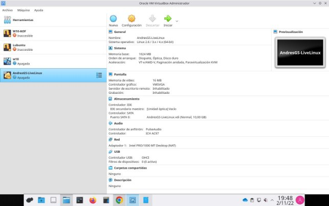
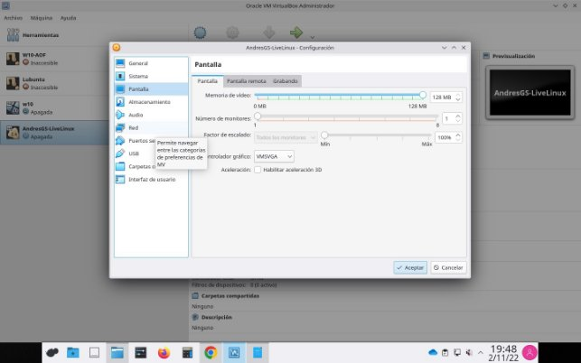
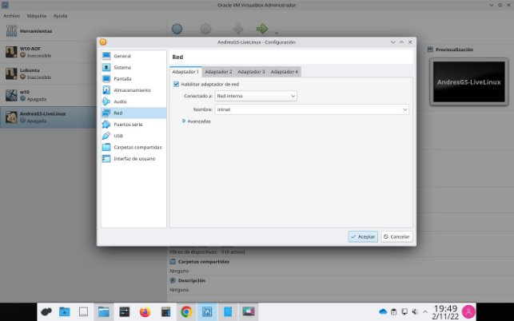
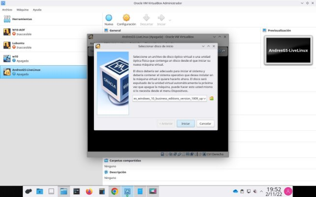
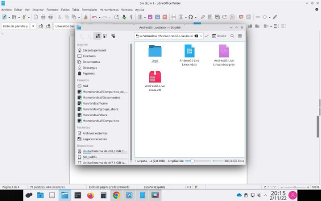
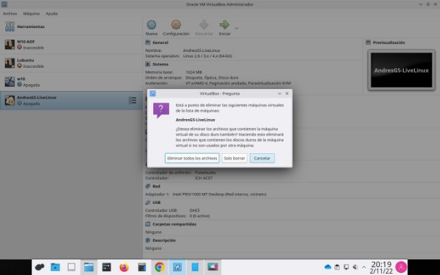
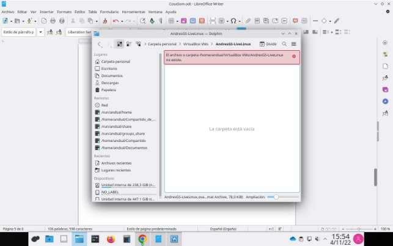

1

2 

Al iniciar me pide un archivo  

3

4

**Puedes copiar/pegar texto desde tu ordenador a la máquina virtual?** 

No deja copiar y pegar desde fuera de la máquina virtual

**¿La máquina virtual tiene conexión a internet?**

No tiene conexión a Internet.

5

**¿Qué ocurre?**

Sale una ventana, al clicar en Enviar señal de apagado se cierra la ventana donde está la máquina virtual.

6

**¿Dónde se encuentran los archivos de la máquina virtual?** 

Se encuentra en /home/andsal/VirtualBox VMs/AndresGS-LiveLinux/

7

**¿Qué tamaño tiene el archivo .OVA?** Pesa 78 KiB

8

**¿Qué ha ocurrido?**

Se ha eliminado la máquina virtual y los archivos que había

