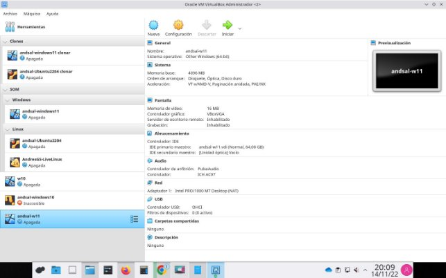

- **¿Qué requisitos técnicos tiene Windows 11? Escríbelos y pon el enlace a la web oficial.**
  - **Procesador / Núcleos:** 1 gigahercio (GHz) con dos núcleos 
  - **RAM:** 4 gigabytes (GB).
  - **Almacenamiento:** 64 GB
  - **Tarjeta gráfica:** compatible con DirectX 12 o posterior, con un controlador WDDM 2.0
- **¿Qué medio de instalación es el más adecuado para máquinas virtuales?** Es simular un CD de instalación mediante imágenes de disco ISO
- **¿Cuál es el sistema de archivos nativo de Windows 11?** Usa el sistema Arm64EC.
- **¿Qué tabla de particiones utiliza Windows 11?**

Pueden usar el formato de archivo GPT o del registro de arranque maestro (MBR)

- **¿Deberías hacer copia de seguridad en este caso concreto de instalación en una nueva máquina virtual? Explica los motivos**

Siempre está bien hacer una copia de seguridad, pero, si se va a usar poco no es del todo necesario.

- **Crea una máquina virtual con el nombre usuario-Win11, donde usuario es tu nombre de usuario del centro, que cumpla con los requisitos técnicos necesarios para la instalación de Windows 11**
- **Haz una captura de pantalla de la máquina virtual creada donde se vea el resumen de su configuración**

- **Reflexiona ¿Los recursos del anfitrión se verán muy afectados por los requisitos especificados para la máquina virtual de Windows 11? ¿Qué recurso prestado por el anfitrión es el que más puede afectar al rendimiento?**

Un mínimo se verá afectado sin embargo dependerá del dispositivo si es más o menos. Principalmente la RAM y los núcleos del procesador.
