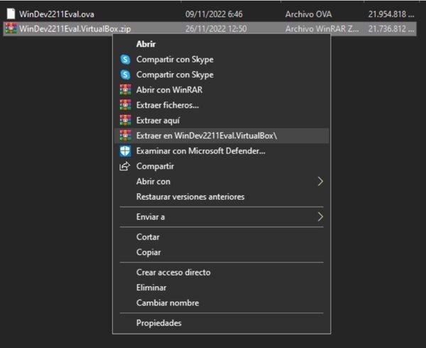
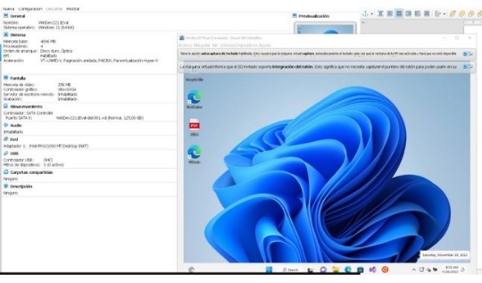

**Instalación Windows 11**

**Modo desarrollador**

**Paso 1 Instalar hipervisor**

Hay que descargare instalar Virtual Box, es el programa que gestionará las máquinas virtuales, se descarga desde [aquí](https://www.virtualbox.org/wiki/Downloads) después se inicia el .exe y se instala con las opciones por defecto

**Paso 2 Descargar la máquina virtual **

Hay que descargar un archivo .zip desde la web de [microsoft.](https://developer.microsoft.com/es-es/windows/downloads/virtual-machines/)

Como el archivo es muy pesado (20 Gb) yo he usado un gestor de descargas, JDownloader2, para no perder el progreso y tarde menos.

**Paso 3 Extraer la máquina virtual** 

El archivo .zip contiene un archivo .ova el cual sirve para importar una nueva máquina virtual en Virtual Box.

Para acceder a este archivo hay que extraer el .zip.

Con WinRAR se puede extraer.

**Paso 4 Importar la máquina virtual** 

Ya descargada la máquina virtual hay que importarla en Virtual Box, En Herramientas→Importar

En la nueva pestaña en Archivo hay que pegar la ubicación del archivo o seleccionarla con el botón de la carpeta, después hay que darle Next y en la nueva ventana darle Importar y esperar a que se importe.

**Paso 5 Iniciar la máquina virtual**

Para iniciarla solo hay que hacer doble click derecho en la máquina virtual y ya se iniciará Windows 11.

